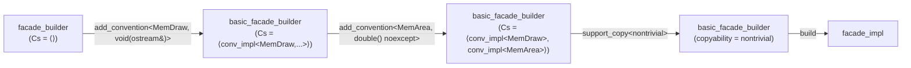
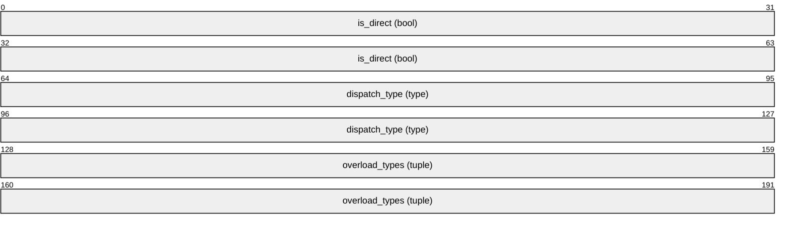
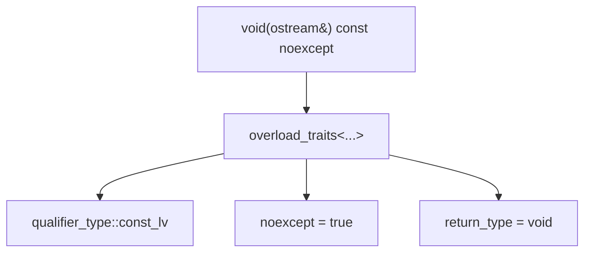
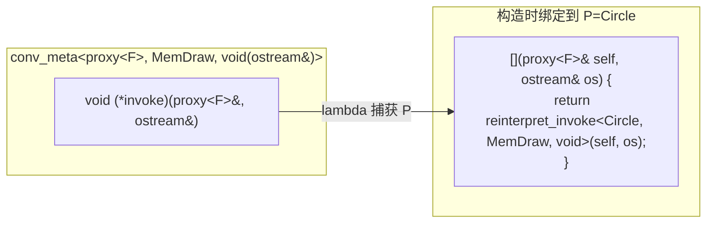
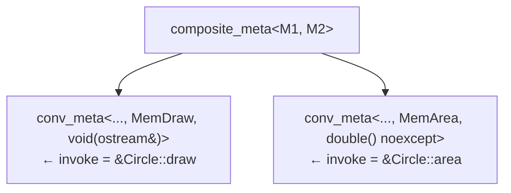
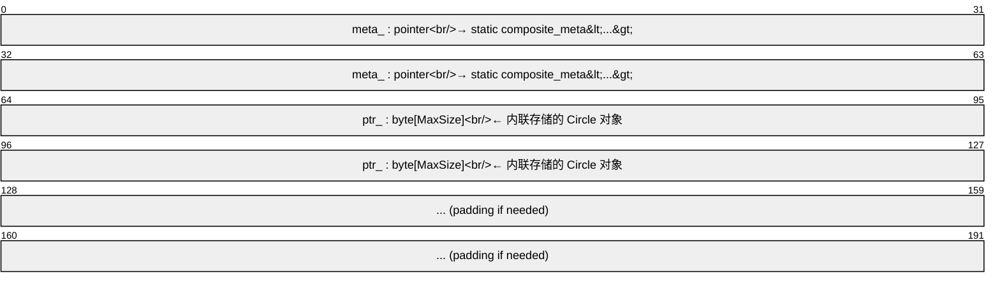
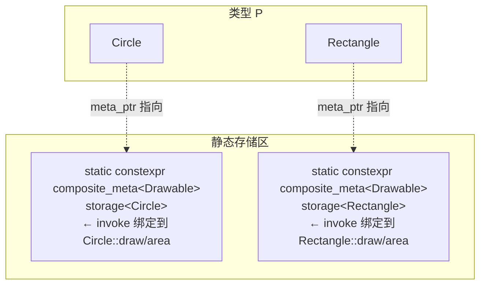
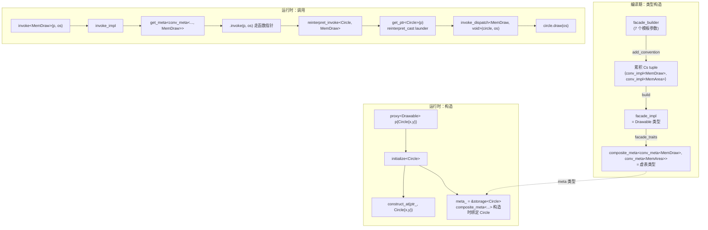

# 微软 proxy 库设计逐层还原教程

> 从零开始，以 TDD 思维逐步还原 `pro::facade_builder` 的完整设计链路。

## 目录

1. [起点：一个示例](#1-起点一个示例)
2. [门面模式 链式 Builder](#2-门面模式--链式-builder)
3. [Convention 的概念](#3-convention-的概念)
4. [函数签名分解：12 种偏特化](#4-函数签名分解12-种偏特化)
5. [运行时虚表：conv_meta](#5-运行时虚表conv_meta)
6. [虚表拼接：多继承 参数包展开](#6-虚表拼接多继承--参数包展开)
7. [派发：从字节存储到真实调用](#7-派发从字节存储到真实调用)
8. [Proxy 数据布局](#8-proxy-数据布局)
9. [完整链路总览](#9-完整链路总览)
10. [总结：为什么要这样设计](#10-总结为什么要这样设计)

---

## 1. 起点：一个示例

```cpp
struct Drawable : pro::facade_builder
    ::add_convention<MemDraw, void(std::ostream& output)>
    ::add_convention<MemArea, double() noexcept>
    ::support_copy<pro::constraint_level::nontrivial>
    ::build {};
```

用户期望：
- 定义一个"接口" `Drawable`，描述"可以被 draw"和"可以求 area"
- 用 `proxy<Drawable>` 包装任意满足该接口的类型（`Circle`、`Rectangle`...）
- 通过 `invoke<MemDraw>(p, os)` 调用被包装对象的方法

**谜题**：C+没有运行时反射，没有 C#/Java 的 interface。如何从零手写一个类型擦除多态机制？

---

## 2. 门面模式 链式 Builder

原始设计核心洞察：**所有"方法"都是 template alias**，每次调用生成新的类型特化。

### 第一步：基础类型

```cpp
template <
 class Cs,              // (1) Conveniton 类型列表
 class Rs,              // (2) Reflection 类型列表
 std::size_t MaxSize,   // (3) 可存储的对象最大 sizeof
 std::size_t MaxAlign,  // (4) 最大对齐
 constraint_level Copyability,       // (5) 拷贝能力需求
 constraint_level Relocatability,    // (6) 移动/ relocation 能力需求
 constraint_level Destructibility    // (7) 析构能力需求
+>
struct basic_facade_builder {
  basic_facade_builder() = delete;
};

using facade_builder = basic_facade_builder<
  std::tuple<>, std::tuple<>,     // 空 convention / reflection 列表
  invalid_size, invalid_size,     // 未设置，build 时使用默认值
  invalid_cl, invalid_cl, invalid_cl>;
```

`facade_builder` 是一个有 7 个模板参数的结构体，所有成员都是 **using alias**。

* `Cs` (`convention_types`) — `std::tuple<...>`，每个元素是一个 `conv_impl<IsDirect, D, Os...>`，描述该 `facade` 支持哪些"约定"（即成员函数接口）。`add_convention` 就是往这个 `tuple` 尾部追加一个元素。

* `Rs` (`reflection_types`) — `std::tuple<...>`，每个元素是一个 `refl_impl<IsDirect, R>`，描述反射接口。`init.h` 示例没用反射，所以始终为空 `tuple`。

* `MaxSize` / `MaxAlign` — 存储区的尺寸和对齐限制。被包装的实际对象必须满足 `sizeof(P) <= MaxSize && alignof(P) <= MaxAlign`，否则编译期报错。`restrict_layout` 可以收紧，`add_facade` 自动取多个 `facade` 的 `min`。

* `Copyability` / `Relocatability` / `Destructibility` — 三个生命周期约束，取值 `none` < `nontrivial` < `nothrow` < `trivial`。每个值代表该 `facade` 对被包装类型的要求：

  - `none` — 不需要该操作

  - `nontrivial` — 需要能正常做（如 `is_copy_constructible`）

  - `nothrow` — 还需要 `noexcept`

  - `trivial` — 还需要 trivial（如 `is_trivially_copy_constructible`）


`build` 时若参数是 `invalid_cl` 会填入默认值：`copy` → `none`、`relocate` → `trivial`、`destruct` → `nothrow`。


**特别介绍**

* `Convention` — 定义 proxy 对象可以调用哪些"成员函数"。每个 convention 包含：

  - `IsDirect`：是否直接访问（`true` = `proxy<F>` 直接调用，`false` = 通过指针间接访问）

  - `dispatch_type`：调用分发器（如 `MemDraw`，用 `PRO_DEF_MEM_DISPATCH` 宏定义，本质是一个仿函数，告诉你实际调用被包装对象的哪个成员函数）

  - `overload_types`：该接口有哪些重载签名（如 `void(std::ostream& output)`）


示例中 `add_convention<MemDraw, void(std::ostream& output)>` 的意思是：这个 `facade` 有一个 convention，`dispatch` 类是 `MemDraw`（调用 `p.draw(output)`），签名是 `void(std::ostream&)`。

* `Reflection` — 允许从 proxy 中提取编译期已知的静态元数据。用法类似：

```cpp
struct MyReflector : pro::facade_builder
    ::add_reflection<SomeTypeInfo>
    ::build {};
const auto& info = reflect<SomeTypeInfo>(proxy_obj);
```

它不涉及调用被包装对象的成员函数，而是把某个类型信息"挂"在 facade 上供提取。init.h 的示例没有用到 `reflection`，所以 `Rs` 始终为空 `tuple`。

### 第二步：add_convention —— 追加到类型列表

```cpp
template <class D, class... Os>
using add_convention = basic_facade_builder<
  add_to_tuple_t<Cs, conv_impl<false, D, Os...>>,  // ← 追加
  Rs, MaxSize, MaxAlign, Copyability, Relocatability, Destructibility>;
```

每次调用 `add_convention` 会将新的 `convention` 追加到 `Cs` tuple 的末尾。

例如，经过两条链式调用：

```cpp
// 初始状态：Cs = std::tuple<>

// 第一条 add_convention<MemDraw, void(ostream&)>
// 结果：
Cs = std::tuple<conv_impl<false, MemDraw, void(ostream&)>>

// 第二条 add_convention<MemArea, double() noexcept>
// 结果：
Cs = std::tuple<
    conv_impl<false, MemDraw, void(ostream&)>,
    conv_impl<false, MemArea, double() noexcept>
>
```

因此，每次 `add_convention` 都会生成一个新的 `basic_facade_builder` 特化类型，其 `Cs` 成员比旧类型多一个尾部元素（即新添加的 `conv_impl`），而其他模板参数（如 `Rs`、`MaxSize`、生命周期约束等）保持不变。这就是链式积累 `convention` 列表的机制。

每次调用生成新特化，`Cs` 比之前多一个元素：



### 第三步：build —— 产出最终类型

```cpp
using build = facade_impl<
  Cs, Rs,
  MaxSize == invalid_size ? sizeof(void*) * 2 : MaxSize,
  MaxAlign == invalid_size ? alignof(void*) : MaxAlign,
  Copyability == invalid_cl ? constraint_level::none : Copyability,
  Relocatability == invalid_cl ? constraint_level::trivial : Relocatability,
  Destructibility == invalid_cl ? constraint_level::nothrow : Destructibility>;
```

`build` 应用默认值并产出 `facade_impl`——最终 facade 类型。

---

## 3. Convention 的概念

```CPP
template <bool IsDirect, class D, class... Os>
struct conv_impl {
   static constexpr bool is_direct = IsDirect;
   using dispatch_type = D;         // 调用派发器（如 MemDraw）
   using overload_types = std::tuple<Os...>;  // 签名列表
};
```

每个 convention = **面向协议的描述**：

- `IsDirect`：直接访问还是通过指针间接访问

- `dispatch_type`：结构体仿函数，如 `MemDraw`，通常由 `PRO_DEF_MEM_DISPATCH` 等宏生成。它的 `operator()` 接受被包装的对象（通过转发引用），并调用该对象的对应成员函数（如 `self.draw()`）。其职责是在编译期定义“如何执行”该操作：

  ```
  struct MemDraw {
    template <class T>
    decltype(auto) operator()(T&& self) const {
      return std::forward<T>(self).draw();  // 调用成员函数 draw
    }
  };
  ```

- `overload_types`：是一个函数签名的编译期列表，类型为 `std::tuple<...>`（例如 `std::tuple<void(std::ostream&)>`）。它**不是**具体的函数指针对象，而是用于在编译期生成 `conv_meta` 的特化：

  ```
  // 每个签名会生成一个 conv_meta 特化
  struct conv_meta<ProP, D, void(std::ostream& output)> {
      void (*invoke)(ProP, std::ostream&); // 真正的运行时函数指针
  };
  ```

  因此，`overload_types` 提供了编译期元数据，`conv_meta` 则根据这些元数据生成对应的函数指针成员，在运行时实际调用。简单总结：`dispatch_type` 决定“调用对象的哪个函数”，而 `overload_types` 决定“该函数有哪些重载形态”，两者配合完成从编译期定义到运行时派发的映射。




```
#pragma once

#include <cstddef>
#include <limits>
#include <tuple>
#include <type_traits>

namespace pro::inline v4 {

enum class constraint_level { none, nontrivial, nothrow, trivial };

namespace details {

// 1) 每个 convention 的描述：是否直接访问、dispatch 类型、重载列表
template <bool IsDirect, class D, class... Os>
struct conv_impl {
  static constexpr bool is_direct = IsDirect;
  using dispatch_type = D;
  using overload_types = std::tuple<Os...>;
};

// 2) 向 std::tuple 追加一个元素
template <class Tuple, class T>
struct add_to_tuple;
template <class... Ts, class T>
struct add_to_tuple<std::tuple<Ts...>, T> {
  using type = std::tuple<Ts..., T>;
};
template <class Tuple, class T>
using add_to_tuple_t = typename add_to_tuple<Tuple, T>::type;

// 3) build 的最终产物
template <class Cs, class Rs,
          std::size_t MaxSize, std::size_t MaxAlign,
          constraint_level Copyability,
          constraint_level Relocatability,
          constraint_level Destructibility>
struct facade_impl {
  using convention_types = Cs;
  using reflection_types = Rs;
  static constexpr std::size_t max_size = MaxSize;
  static constexpr std::size_t max_align = MaxAlign;
  static constexpr constraint_level copyability = Copyability;
  static constexpr constraint_level relocatability = Relocatability;
  static constexpr constraint_level destructibility = Destructibility;
};

// 4) 标记值，表示"未设置"
inline constexpr std::size_t invalid_size = std::numeric_limits<std::size_t>::max();
inline constexpr constraint_level invalid_cl =
    static_cast<constraint_level>(std::numeric_limits<int>::min());

} // namespace details

// 5) Builder，所有成员都是 type alias，形成 CRTP 链
template <class Cs, class Rs,
          std::size_t MaxSize, std::size_t MaxAlign,
          constraint_level Copyability,
          constraint_level Relocatability,
          constraint_level Destructibility>
struct basic_facade_builder {
  // add_convention: 默认 indirect convention
  template <class D, class... Os>
  using add_convention = basic_facade_builder<
    details::add_to_tuple_t<Cs, details::conv_impl<false, D, Os...>>,
    Rs, MaxSize, MaxAlign, Copyability, Relocatability, Destructibility>;

  // support_copy: 提升 copyability 约束
  template <constraint_level CL>
  using support_copy = basic_facade_builder<
    Cs, Rs, MaxSize, MaxAlign,
    CL,  // 简化：直接替换（原始设计用 merge_constraint）
    Relocatability, Destructibility>;

  // build: 产出最终 facade 类型，应用默认值
  using build = details::facade_impl<
    Cs, Rs,
    MaxSize == details::invalid_size ? sizeof(void*) * 2 : MaxSize,
    MaxAlign == details::invalid_size ? alignof(void*) : MaxAlign,
    Copyability == details::invalid_cl ? constraint_level::none : Copyability,
    Relocatability == details::invalid_cl ? constraint_level::trivial : Relocatability,
    Destructibility == details::invalid_cl ? constraint_level::nothrow : Destructibility>;

  basic_facade_builder() = delete;
};

// 6) facade_builder：链起点，全为默认
using facade_builder =
  basic_facade_builder<std::tuple<>, std::tuple<>,
                       details::invalid_size, details::invalid_size,
                       details::invalid_cl,
                       details::invalid_cl,
                       details::invalid_cl>;

} // namespace pro::inline v4

```


---

## 4. 函数签名分解：12 种偏特化

C+函数签名携带限定符信息：`const`、`&`、`&&`、`noexcept`。需要提取它们。

### qualifier_type 枚举

```cpp
enum class qualifier_type { lv, const_lv, rv, const_rv };
```

### add_qualifier_traits

```diff
// 4) 函数签名分解

enum class qualifier_type { lv, const_lv, rv, const_rv };

+ template <class T, qualifier_type Q>
+ struct add_qualifier_traits;
+ template <class T>
+ struct add_qualifier_traits<T, qualifier_type::lv> : std::type_identity<T&> {};
+ template <class T>
+ struct add_qualifier_traits<T, qualifier_type::const_lv>
+     : std::type_identity<const T&> {};
+ template <class T>
+ struct add_qualifier_traits<T, qualifier_type::rv> : std::type_identity<T&&> {};
+ template <class T>
+ struct add_qualifier_traits<T, qualifier_type::const_rv>
+     : std::type_identity<const T&&> {};
+ template <class T, qualifier_type Q>
+ using add_qualifier_t = typename add_qualifier_traits<T, Q>::type;
+ template <class T, qualifier_type Q>
+ using add_qualifier_ptr_t = std::remove_reference_t<add_qualifier_t<T, Q>>*;

struct applicable_traits {
  static constexpr bool applicable = true;
};
struct inapplicable_traits {

```

### overload_traits —— 12 个偏特化

C+函数类型有 6 种限定组合，各分 noexcept/非 noexcept，共 12 种：

```diff
static constexpr constraint_level relocatability = Relocatability;
  static constexpr constraint_level destructibility = Destructibility;
};

// 4) 函数签名分解
+ 
+ enum class qualifier_type { lv, const_lv, rv, const_rv };
+ 
+ struct applicable_traits {
+   static constexpr bool applicable = true;
+ };
+ struct inapplicable_traits {
+   static constexpr bool applicable = false;
+ };
+ 
+ template <class O>
+ struct overload_traits : inapplicable_traits {};
+ template <qualifier_type Q, bool NE, class R, class... Args>
+ struct overload_traits_impl : applicable_traits {
+   using return_type = R;
+   template <class, bool, class>
+   static constexpr bool applicable_ptr = true; // 暂存根
+ };
+ template <class R, class... Args>
+ struct overload_traits<R(Args...)>
+     : overload_traits_impl<qualifier_type::lv, false, R, Args...> {};
+ template <class R, class... Args>
+ struct overload_traits<R(Args...) noexcept>
+     : overload_traits_impl<qualifier_type::lv, true, R, Args...> {};
+ template <class R, class... Args>
+ struct overload_traits<R(Args...) &>
+     : overload_traits_impl<qualifier_type::lv, false, R, Args...> {};
+ template <class R, class... Args>
+ struct overload_traits<R(Args...) & noexcept>
+     : overload_traits_impl<qualifier_type::lv, true, R, Args...> {};
+ template <class R, class... Args>
+ struct overload_traits<R(Args...) &&>
+     : overload_traits_impl<qualifier_type::rv, false, R, Args...> {};
+ template <class R, class... Args>
+ struct overload_traits<R(Args...) && noexcept>
+     : overload_traits_impl<qualifier_type::rv, true, R, Args...> {};
+ template <class R, class... Args>
+ struct overload_traits<R(Args...) const>
+     : overload_traits_impl<qualifier_type::const_lv, false, R, Args...> {};
+ template <class R, class... Args>
+ struct overload_traits<R(Args...) const noexcept>
+     : overload_traits_impl<qualifier_type::const_lv, true, R, Args...> {};
+ template <class R, class... Args>
+ struct overload_traits<R(Args...) const&>
+     : overload_traits_impl<qualifier_type::const_lv, false, R, Args...> {};
+ template <class R, class... Args>
+ struct overload_traits<R(Args...) const & noexcept>
+     : overload_traits_impl<qualifier_type::const_lv, true, R, Args...> {};
+ template <class R, class... Args>
+ struct overload_traits<R(Args...) const&&>
+     : overload_traits_impl<qualifier_type::const_rv, false, R, Args...> {};
+ template <class R, class... Args>
+ struct overload_traits<R(Args...) const && noexcept>
+     : overload_traits_impl<qualifier_type::const_rv, true, R, Args...> {};
+ template <class O>
+ using ret_t = typename overload_traits<O>::return_type;
+ 
+ // 5) 标记值，表示"未设置"
inline constexpr std::size_t invalid_size = std::numeric_limits<std::size_t>::max();
inline constexpr constraint_level invalid_cl =
    static_cast<constraint_level>(std::numeric_limits<int>::min());
```




### 为什么必须是偏特化而不是运行时判断？

因为 `const`、`&`、`&&`、`noexcept` 是 **类型系统的一部分**，运行时无法内省。必须用模板偏特化将它们"拆解"为编译期值：

```cpp
// 编译期：overload_traits<void(ostream&) const> 匹配 const 特化
// 拆解出 Q=const_lv, NE=false, R=void, Args=⟨ostream&⟩
// 这些信息决定 conv_meta 中函数指针的签名
```

---

## 5. 运行时虚表：conv_meta

它的作用：把每个 `overload_traits` 分解出的签名 → 一个实际的函数指针 `R (*invoke)(ProP, Args...)`，构造时绑定到具体类型 `P` 的成员函数上。

结构示意：

```cpp
conv_meta<proxy<F>, MemDraw, void(std::ostream&)>
  // 存一个 void(*)(proxy<F>, std::ostream&) 函数指针
  // 构造时被 P=Circle 实例化，回调 Circle::draw
```


几个独立的 `conv_meta` 组合起来 = `composite_meta`，就是 `facade` 完整的虚函数表。

```diff
    : overload_traits_impl<qualifier_type::const_rv, true, R, Args...> {};
template <class O>
using ret_t = typename overload_traits<O>::return_type;

+ // 5) conv_meta — 运行时函数指针表
+ 
+ template <class ProP, class D, class O>
+ struct conv_meta;
+ 
+ #define PROD_DEF_CONV_META(oq, pq, ne, ...)                                    \
+   template <class ProP, class D, class R, class... Args>                       \
+   struct conv_meta<ProP, D, R(Args...) oq ne> {                                \
+     R (*invoke)(ProP pq self, Args... args) ne;                                \
+     template <class P>                                                         \
+     constexpr explicit conv_meta(std::in_place_type_t<P>)                      \
+         : invoke([](ProP pq self, Args... args) ne -> R {                     \
+             return reinterpret_invoke<P, D, R>(                                 \
+                 static_cast<ProP pq>(self),                                     \
+                 std::forward<Args>(args)...);                                   \
+           }) {}                                                                \
+   }
+ 
+ #define PROD_OVLD_SPECS(macro, ...)                                            \
+   macro(, &, , __VA_ARGS__);                                                   \
+   macro(, &, noexcept, __VA_ARGS__);                                           \
+   macro(&, &, , __VA_ARGS__);                                                  \
+   macro(&, &, noexcept, __VA_ARGS__);                                          \
+   macro(&&, &&, , __VA_ARGS__);                                                \
+   macro(&&, &&, noexcept, __VA_ARGS__);                                        \
+   macro(const, const&, , __VA_ARGS__);                                         \
+   macro(const, const&, noexcept, __VA_ARGS__);                                 \
+   macro(const&, const&, , __VA_ARGS__);                                        \
+   macro(const&, const&, noexcept, __VA_ARGS__);                                \
+   macro(const&&, const&&, , __VA_ARGS__);                                      \
+   macro(const&&, const&&, noexcept, __VA_ARGS__);
+ 
+ PROD_OVLD_SPECS(PROD_DEF_CONV_META)
+ #undef PROD_DEF_CONV_META
+ #undef PROD_OVLD_SPECS
+ 
+ // 6) 标记值，表示"未设置"
inline constexpr std::size_t invalid_size = std::numeric_limits<std::size_t>::max();
inline constexpr constraint_level invalid_cl =
    static_cast<constraint_level>(std::numeric_limits<int>::min());

```

**核心：** `conv_meta` 存一个**函数指针** `invoke`。构造时传入类型 `P`，lambda 捕获 `P` 生成实际的调用代码。

```
每个签名 ↔ 一个函数指针成员 R (*invoke)(ProP, Args...)：
conv_meta<proxy<F>, MemDraw, void(std::ostream& output)>
  → void (*invoke)(proxy<F>&, std::ostream&)

conv_meta<proxy<F>, MemArea, double() noexcept>
  → double (*invoke)(proxy<F>&) noexcept
  
构造时绑定到具体类型 P，reinterpret_invoke 负责从 proxy<F> 提取出 P& 并调用 MemDraw::operator()(P&)。
```



**每个类型 P 生成一份静态的 conv_meta 实例**，保存在 `meta_ptr` 的 `storage` 中（`static constexpr` 变量）。

---

## 6. 虚表拼接：多继承 参数包展开

### composite_meta

`proxy<F>::meta_` → `composite_meta<ConvMeta_A, ConvMeta_B>` ← “虚表”
- `ConvMeta_A` 提供所有 `MemDraw` 签名的函数指针
- `ConvMeta_B` 提供所有 `MemArea` 签名的函数指针

每个 `conv_meta<..., void(ostream&)>` 贡献一个 `void(*invoke)(proxy<F>&, ostream&)`；
每个 `conv_meta<..., double() noexcept>` 贡献一个 `double(*invoke)(proxy<F>&) noexcept`。

`composite_meta` 通过多继承将这些 `conv_meta` 聚合在一起，从而让一个对象持有所有约定的函数指针。

对比 C++ 虚表：

| C++ vtable                   | proxy vtable                                   |
| :--------------------------- | :--------------------------------------------- |
| 编译器自动生成               | 编译期 `conv_meta` 模板实例化                  |
| 每个虚函数对应一个函数指针槽 | 每个 `convention` 的每个签名对应一个函数指针槽 |
| 构造时由编译器填写           | 构造时由 lambda 捕获具体类型 `P` 并填入        |

本质上，这是一个**手动实现的多态派发表**，借助多继承将不同协议（convention）的函数指针聚合到同一个对象中，从而在运行时支持类型擦除调用。


```diff
PROD_OVLD_SPECS(PROD_DEF_CONV_META)
#undef PROD_DEF_CONV_META
#undef PROD_OVLD_SPECS

+ // 6) composite_meta — 组合多个 conv_meta 成完整的虚表
+ 
+ template <class... Ms>
+ struct composite_meta : Ms... {
+   composite_meta() = default;
+   template <class P>
+   constexpr explicit composite_meta(std::in_place_type_t<P>)
+       : Ms(std::in_place_type<P>)... {}
+ };
+ 
+ // 7) 标记值，表示"未设置"
inline constexpr std::size_t invalid_size = std::numeric_limits<std::size_t>::max();
inline constexpr constraint_level invalid_cl =
    static_cast<constraint_level>(std::numeric_limits<int>::min());
```

**多继承把多个函数指针聚合到一处：**



**参数包展开** `Ms(std::in_place_type<P>)...` 用一行初始化所有基类：

```cpp
// 等价于：
composite_meta(std::in_place_type<Circle>)
    : conv_meta<..., MemDraw, void(ostream&)>(std::in_place_type<Circle>)  // ↑
    , conv_meta<..., MemArea, double() noexcept>(std::in_place_type<Circle>) // ↑
{}
```

### 从 conventions 到 composite_meta 的元编程管线

```cpp
template <class C, class F, class... Os>
struct conv_traits_impl {
  using meta = composite_meta<conv_meta<proxy<F>, typename C::dispatch_type, Os>...>;
};

template <class C, class F>
struct conv_traits
    : instantiated_t<conv_traits_impl, typename C::overload_types, C, F> {};
```

`instantiated_t` 将 `overload_types` tuple 展开为变参：

```cpp
// conv_impl<false, MemDraw, void(ostream&)> → overload_types = ⟨void(ostream&)⟩
// → instantiated_t 展开为 conv_traits_impl<C, F, void(ostream&)>
// → meta = composite_meta<conv_meta<..., MemDraw, void(ostream&)>>
//
// conv_impl<false, MemArea, double() noexcept> → overload_types = ⟨double() noexcept⟩
// → meta = composite_meta<conv_meta<..., MemArea, double() noexcept>>
```

```cpp
template <class F, class... Cs>
struct facade_conv_traits_impl {
  using conv_meta = composite_meta<typename conv_traits<Cs, F>::meta...>;
};

template <class F>
struct facade_traits
    : instantiated_t<facade_conv_traits_impl, typename F::convention_types, F> {
  using meta = typename facade_traits::conv_meta;
};
```

最终 `facade_traits<Drawable>::meta` 展开为：

```
composite_meta<
  composite_meta<conv_meta<proxy<Drawable>, MemDraw, void(ostream&)>>,
  composite_meta<conv_meta<proxy<Drawable>, MemArea, double() noexcept>>
>
```

由于 C+多继承的传递性，外层 `static_cast` 仍能找到任意内层 `conv_meta` 基类。

---

## 7. 派发：从字节存储到真实调用

### proxy_helper —— 提取虚表和存储

```diff
  constexpr explicit composite_meta(std::in_place_type_t<P>)
      : Ms(std::in_place_type<P>)... {}
};

+ // 7) proxy_helper — 从 proxy 提取虚表 + 存储对象
+ 
+ template <class F>
+ class proxy;
+ 
+ struct proxy_helper {
+   template <class M, class F>
+   static const M& get_meta(const proxy<F>& p) noexcept {
+     assert(p.has_value());
+     return static_cast<const M&>(*p.meta_.operator->());
+   }
+   template <class P, class F, qualifier_type Q>
+   static add_qualifier_t<P, Q> get_ptr(add_qualifier_t<proxy<F>, Q> p) {
+     return static_cast<add_qualifier_t<P, Q>>(
+         *std::launder(
+             reinterpret_cast<add_qualifier_ptr_t<P, Q>>(p.ptr_)));
+   }
+ };
+ 
+ // 8) 标记值，表示"未设置"
inline constexpr std::size_t invalid_size = std::numeric_limits<std::size_t>::max();
inline constexpr constraint_level invalid_cl =
    static_cast<constraint_level>(std::numeric_limits<int>::min());
```

**两者的关系：**

| 函数 | 提取什么 | 用途 |
|---|---|---|
| `get_meta` | `meta_` → `conv_meta::invoke` 函数指针 | 找到"该调用哪个函数" |
| `get_ptr` | `ptr_` → `Circle&`（从字节数组 reinterpret） | 找到"对哪个对象调用" |

`proxy_helper` 提供两个关键操作：

- **`get_meta<M>(proxy)`** — 获取虚表指针  
  调用 `p.meta_.operator->()` 得到 `composite_meta*`，然后通过 `static_cast` 转换为具体的 `conv_meta<...>*` 类型（`M` 为要获取的约定类型）。

- **`get_ptr<P>(proxy)`** — 获取被包装对象的引用  
  从 `p.ptr_`（原始存储指针）出发，执行 `reinterpret_cast<P*>` 得到对象指针，再经 `std::launder` 确保指针安全，最终得到 `P&` 引用。

```cpp
// 伪代码示意
template <class Proxy, class M>
auto get_meta(Proxy& p) {
    auto* composite = p.meta_.operator->();
    return static_cast<const conv_meta<M>*>(composite);
}

template <class P, class Proxy>
P& get_ptr(Proxy& p) {
    auto* raw = reinterpret_cast<P*>(p.ptr_);
    return *std::launder(raw);
}
```

<u>**意思是有可能有多个类circle、rectangle、triangle等都支持convention协议——draw、area等，proxy需要找到是哪个类对象调用了draw、area函数进而实现多态，**</u>

```markdown
`proxy<Drawable>` 的实例化示例：

```cpp
proxy<Drawable> p1{Circle{x, y}};     // ptr_ 存 Circle，  虚表指向 Circle 的 draw/area
proxy<Drawable> p2{Rectangle{w, h}};  // ptr_ 存 Rectangle，虚表指向 Rectangle 的 draw/area
```

调用约定 `MemDraw` 时：

```cpp
invoke<MemDraw>(p1, os);  // → get_ptr → Circle& → Circle::draw(os)
invoke<MemDraw>(p2, os);  // → get_ptr → Rectangle& → Rectangle::draw(os)
```

`ptr_` 存储的对象不同，`meta_` 指向的虚表也不同。对于每个具体类型 `P`，会生成一份**静态的** `composite_meta` 实例，其中的函数指针在构造时绑定到 `P` 的成员函数上。

这就是 `proxy` 实现的多态机制：
- **类型擦除** — 对外统一使用 `proxy<Drawable>` 类型
- **内联存储** — 对象直接存储在 `proxy` 内部缓冲区（`ptr_`）
- **手动虚表** — 通过 `composite_meta` 聚合函数指针，在运行时动态派发

### invoke_dispatch —— 调用仿函数

```diff
            reinterpret_cast<add_qualifier_ptr_t<P, Q>>(p.ptr_)));
  }
};

+ // 8) invoke_dispatch — 调用 dispatch 仿函数
+ 
+ template <class D, class R, class... Args>
+ R invoke_dispatch(Args&&... args) {
+   if constexpr (std::is_void_v<R>) {
+     D()(std::forward<Args>(args)...);
+   } else {
+     return D()(std::forward<Args>(args)...);
+   }
+ }
+ 
+ // 9) 标记值，表示"未设置"
inline constexpr std::size_t invalid_size = std::numeric_limits<std::size_t>::max();
inline constexpr constraint_level invalid_cl =
    static_cast<constraint_level>(std::numeric_limits<int>::min());

```

创建 dispatch 类型 `D` 的临时对象，调用其 `operator()`：

```cpp
invoke_dispatch<MemDraw, void>(circle, os)
  → MemDraw()(circle, os)        // circle.draw(os)

invoke_dispatch<MemArea, double>(circle)
  → MemArea()(circle)            // circle.area()
```

区别只是 void 返回时用 if constexpr 避免 return void_expr; 不合法。


### reinterpret_invoke——字节数据还原为具体对象

```diff
    return D()(std::forward<Args>(args)...);
  }
}

+ // 9) proxy_accessor + operand_t + reinterpret_invoke
+ 
+ template <class F, bool IsDirect, qualifier_type Q>
+ using proxy_accessor = add_qualifier_t<
+     std::conditional_t<IsDirect, proxy<F>, void>, Q>;
+ 
+ template <class P, bool IsDirect, qualifier_type Q>
+ struct operand_traits : add_qualifier_traits<P, Q> {};
+ template <class P, qualifier_type Q>
+ struct operand_traits<P, false, Q>
+     : std::type_identity<decltype(*std::declval<add_qualifier_t<P, Q>>())> {};
+ template <class P, bool IsDirect, qualifier_type Q>
+ using operand_t = typename operand_traits<P, IsDirect, Q>::type;
+ 
+ template <class P, class F, qualifier_type Q, class D, class R, class... Args>
+ R reinterpret_invoke(proxy_accessor<F, true, Q> self, Args&&... args) {
+   return invoke_dispatch<D, R>(
+       proxy_helper::get_ptr<P, F, Q>(
+           std::forward<proxy_accessor<F, true, Q>>(self)),
+       std::forward<Args>(args)...);
+ }
+ 
+ // 10) 标记值，表示"未设置"
inline constexpr std::size_t invalid_size = std::numeric_limits<std::size_t>::max();
inline constexpr constraint_level invalid_cl =
    static_cast<constraint_level>(std::numeric_limits<int>::min());

```

`reinterpret_invoke` 的作用：将 `proxy<F>` 的字节存储转换为正确的 `P&`，再传递给 `invoke_dispatch`，是 **storage → operand** 的桥梁。

### 整条调用链

1. 用户定义 `facade`

```cpp
struct Drawable : pro::facade_builder
    ::add_convention<MemDraw, void(std::ostream&)>
    ::add_convention<MemArea, double() noexcept>
    ::build {};
```

2. 用户使用:

```cpp
Circle c;
proxy<Drawable> p{&c};          // ① ptr_ 存 Circle*, meta_ 指向 Circle 虚表
invoke<MemDraw>(p, os);         // ② 入口
  → invoke_impl(p, os)          // ③ 取虚表 + 调函数指针
    → get_meta<conv_meta<...>>  // ④ 从 meta_ 定位到 MemDraw 的 conv_meta
    → .invoke(p, os)            // ⑤ 走函数指针
      → reinterpret_invoke      // ⑥ 从 ptr_ 提取 Circle&
        → get_ptr               // ⑦ reinterpret_cast + launder
        → invoke_dispatch       // ⑧ MemDraw()(circle, os)
          → circle.draw(os)     // ⑨ 真实调用
```

3. 数据布局

```cpp
proxy<Drawable> p{&c}:
  meta_: ptr → 静态 composite_meta<conv_meta<..., MemDraw>,
                                   conv_meta<..., MemArea>>
  ptr_:  byte[MaxSize] ← 这里存 Circle*
```

**整条调用链路（从用户调用到实际对象）**：

1. `invoke<MemDraw>(proxy, os)` ← 用户调用
2. → `proxy_helper::get_meta(proxy)` ← 取虚表
3. → `meta_->invoke(proxy, os)` ← 走函数指针（位于 `conv_meta`）
4. → `reinterpret_invoke<P>(...)` ← 从 `ptr_` 提取 `P&`
5. → `invoke_dispatch<MemDraw>` ← 调用分发器
6. → `MemDraw()(p, os)` ← 创建仿函数临时对象
7. → `p.draw(os)` ← 实际调用 `Circle::draw`

`reinterpret_invoke` 是**去类型擦除**的关键点——它将无类型的字节数组 `ptr_` 还原为具体类型 `Circle&`，然后分发器（`dispatch`）才能在该对象上调用正确的成员函数。

```
invoke<MemDraw>(proxy, os)
  │
  ├─ invoke_impl<MemDraw, void(ostream&)>(proxy, os)
  │   │
  │   ├─ proxy_helper::get_meta<conv_meta<..., MemDraw, void(ostream&)>>(proxy)
  │   │   └─ static_cast<const conv_meta<...>&>(*proxy.meta_.operator->())
  │   │       → 定位到 MemDraw 的函数指针
  │   │
  │   └─ meta_.invoke(proxy, os)
  │       │
  │       └─ reinterpret_invoke<Circle, MemDraw>(proxy, os)
  │           │
  │           ├─ proxy_helper::get_ptr<Circle>(proxy)
  │           │   └─ std::launder(reinterpret_cast<Circle*>(proxy.ptr_))
  │           │       → Circle&
  │           │
  │           └─ invoke_dispatch<MemDraw, void>(circle, os)
  │               └─ MemDraw()(circle, os)
  │                   → circle.draw(os)
```

---

## 8. Proxy 数据布局

```cpp
template <facade F>
class proxy {
  friend struct details::proxy_helper;
public:
  template <class P>
  constexpr proxy(P&& ptr) noexcept(...) {
    initialize<std::decay_t<P>>(std::forward<P>(ptr));
  }
  bool has_value() const noexcept { return meta_.has_value(); }
  
  template <class D, class O, class... Args>
  friend ret_t<O> invoke(proxy& p, Args&&... args) {
    return invoke_impl<D, O>(p, std::forward<Args>(args)...);
  }

private:
  template <class P, class... Args>
  constexpr P& initialize(Args&&... args) {
    P& result = *std::construct_at(reinterpret_cast<P*>(ptr_), args...);
    meta_ = meta_ptr<facade_traits<F>::meta>{std::in_place_type<P>};
    return result;
  }

  meta_ptr<facade_traits<F>::meta> meta_;  // 虚表指针
  alignas(F::max_align) std::byte ptr_[F::max_size];  // 内联存储
};
```

### 数据布局



**不是传统多态**（对象外部分配，vptr 在对象内部），**proxy 是 inline storage**：

```cpp
// 传统虚函数多态：
Circle* p = new Circle();  // Circle 在堆上，vptr 在 Circle 对象内部

// proxy 多态：
proxy<Drawable> p{Circle{x, y}};  // Circle 就在 ptr_ 里，meta_ 指向静态生成的虚表
```

### meta_ptr —— 静态虚表

```cpp
template <class M>
struct meta_ptr_indirect_impl {
  template <class P>
  explicit meta_ptr_indirect_impl(std::in_place_type_t<P>)
      : ptr_(&storage<P>) {}
  const M* operator->() const noexcept { return ptr_; }
private:
  const M* ptr_;
  template <class P>
  static constexpr M storage{std::in_place_type<P>};  // 每个 P 一份静态虚表
};
```



每个被包装的类型 `P` 在编译期生成一个 `static constexpr` 的 `composite_meta` 实例。`meta_ptr` 只是持有一个指针指向它。

---

## 9. 完整链路总览



### 完整代码（合并示例）

```cpp
// ===== 用户定义 dispatch 类型 =====
struct MemDraw {
  template <class T>
  decltype(auto) operator()(T&& self, std::ostream& os) const {
    return std::forward<T>(self).draw(os);
  }
};
struct MemArea {
  template <class T>
  decltype(auto) operator()(T&& self) const noexcept {
    return std::forward<T>(self).area();
  }
};

// ===== 用户定义 facade =====
struct Drawable : pro::facade_builder
    ::add_convention<MemDraw, void(std::ostream& output)>
    ::add_convention<MemArea, double() noexcept>
    ::support_copy<pro::constraint_level::nontrivial>
    ::build {};

// ===== 任意满足接口的类型 =====
class Circle {
  double x_, y_, r_;
public:
  void draw(std::ostream& os) const { os << "Circle"; }
  double area() const noexcept { return 3.14 * r_ * r_; }
};

// ===== 使用 =====
int main() {
  Circle c{1.0, 2.0, 3.0};
  proxy<Drawable> p{&c};

  std::ostringstream os;
  invoke<MemDraw>(p, os);   // → os << "Circle"
  double a = invoke<MemArea>(p);  // → 28.26

  std::cout << os.str() << " area=" << a << "\n";
}
```

---

## 10. 总结：为什么要这样设计

| 设计决策 | 原因 | 替代方案 |
|---|---|---|
| **template alias 做 Builder** | 零运行时开销，全部类型推导 | 继承+虚函数（有开销） |
| **偏特化解构函数签名** | `const`、`noexcept` 是类型的一部分，无法运行时获取 | 宏展开（不可维护） |
| **函数指针做虚表** | 手动构造 vtable，不受 C+ABI 限制 | `std::function`（有类型擦除开销） |
| **多继承拼接虚表** | 完美利用 C+基类类型转换，天然支持协议叠加 | 每个协议一个数组（索引管理复杂） |
| **内部字节数组存储** | SBO（小对象优化），避免堆分配 | 统一堆分配（性能差） |
| **static constexpr 虚表** | 每个类型 P 生成一份，类型安全 | 运行时填充（增加启动时间） |

### 核心设计哲学

> **把所有可能提前的运算都提前到编译期。**
> 
> 类型列表积累 → 编译期。
> 函数签名分解 → 编译期。
> 虚表生成 → 编译期（static constexpr）。
> 调用链解析 → 编译期（模板实例化）。
> 
> 运行时只剩一件事：**取指针 跳转**——这就是纯 C 级别的性能。

### 对比 C++标准多态

```
传统虚函数：                 proxy：
  class Base {                struct Drawable : facade_builder::build {};
    virtual void draw();        // 没有基类，没有虚函数
    virtual double area();    };
  class Circle : public Base {   // 不需要继承
    void draw() override;       // 任何有 draw/area 的类型都可以
  };
  Base* p = &circle;           proxy<Drawable> p = &circle;
  p->draw();                   invoke<MemDraw>(p, os);
```

proxy 用 **鸭子类型 类型擦除** 替代了传统的继承虚函数，实现了**非侵入式多态**。

# 完整代码

```
#pragma once

#include <cassert>
#include <cstddef>
#include <limits>
#include <memory>
#include <new>
#include <tuple>
#include <type_traits>
#include <utility>

namespace pro::inline v4 {

enum class constraint_level { none, nontrivial, nothrow, trivial };

namespace details {

// 1) 每个 convention 的描述：是否直接访问、dispatch 类型、重载列表
template <bool IsDirect, class D, class... Os>
struct conv_impl {
  static constexpr bool is_direct = IsDirect;
  using dispatch_type = D;
  using overload_types = std::tuple<Os...>;
};

// 2) 向 std::tuple 追加一个元素
template <class Tuple, class T>
struct add_to_tuple;
template <class... Ts, class T>
struct add_to_tuple<std::tuple<Ts...>, T> {
  using type = std::tuple<Ts..., T>;
};
template <class Tuple, class T>
using add_to_tuple_t = typename add_to_tuple<Tuple, T>::type;

// 3) build 的最终产物
template <class Cs, class Rs,
          std::size_t MaxSize, std::size_t MaxAlign,
          constraint_level Copyability,
          constraint_level Relocatability,
          constraint_level Destructibility>
struct facade_impl {
  using convention_types = Cs;
  using reflection_types = Rs;
  static constexpr std::size_t max_size = MaxSize;
  static constexpr std::size_t max_align = MaxAlign;
  static constexpr constraint_level copyability = Copyability;
  static constexpr constraint_level relocatability = Relocatability;
  static constexpr constraint_level destructibility = Destructibility;
};

// 4) 函数签名分解

enum class qualifier_type { lv, const_lv, rv, const_rv };

template <class T, qualifier_type Q>
struct add_qualifier_traits;
template <class T>
struct add_qualifier_traits<T, qualifier_type::lv> : std::type_identity<T&> {};
template <class T>
struct add_qualifier_traits<T, qualifier_type::const_lv>
    : std::type_identity<const T&> {};
template <class T>
struct add_qualifier_traits<T, qualifier_type::rv> : std::type_identity<T&&> {};
template <class T>
struct add_qualifier_traits<T, qualifier_type::const_rv>
    : std::type_identity<const T&&> {};
template <class T, qualifier_type Q>
using add_qualifier_t = typename add_qualifier_traits<T, Q>::type;
template <class T, qualifier_type Q>
using add_qualifier_ptr_t = std::remove_reference_t<add_qualifier_t<T, Q>>*;

struct applicable_traits {
  static constexpr bool applicable = true;
};
struct inapplicable_traits {
  static constexpr bool applicable = false;
};

template <class O>
struct overload_traits : inapplicable_traits {};
template <qualifier_type Q, bool NE, class R, class... Args>
struct overload_traits_impl : applicable_traits {
  using return_type = R;
  template <class, bool, class>
  static constexpr bool applicable_ptr = true; // 暂存根
};
template <class R, class... Args>
struct overload_traits<R(Args...)>
    : overload_traits_impl<qualifier_type::lv, false, R, Args...> {};
template <class R, class... Args>
struct overload_traits<R(Args...) noexcept>
    : overload_traits_impl<qualifier_type::lv, true, R, Args...> {};
template <class R, class... Args>
struct overload_traits<R(Args...) &>
    : overload_traits_impl<qualifier_type::lv, false, R, Args...> {};
template <class R, class... Args>
struct overload_traits<R(Args...) & noexcept>
    : overload_traits_impl<qualifier_type::lv, true, R, Args...> {};
template <class R, class... Args>
struct overload_traits<R(Args...) &&>
    : overload_traits_impl<qualifier_type::rv, false, R, Args...> {};
template <class R, class... Args>
struct overload_traits<R(Args...) && noexcept>
    : overload_traits_impl<qualifier_type::rv, true, R, Args...> {};
template <class R, class... Args>
struct overload_traits<R(Args...) const>
    : overload_traits_impl<qualifier_type::const_lv, false, R, Args...> {};
template <class R, class... Args>
struct overload_traits<R(Args...) const noexcept>
    : overload_traits_impl<qualifier_type::const_lv, true, R, Args...> {};
template <class R, class... Args>
struct overload_traits<R(Args...) const&>
    : overload_traits_impl<qualifier_type::const_lv, false, R, Args...> {};
template <class R, class... Args>
struct overload_traits<R(Args...) const & noexcept>
    : overload_traits_impl<qualifier_type::const_lv, true, R, Args...> {};
template <class R, class... Args>
struct overload_traits<R(Args...) const&&>
    : overload_traits_impl<qualifier_type::const_rv, false, R, Args...> {};
template <class R, class... Args>
struct overload_traits<R(Args...) const && noexcept>
    : overload_traits_impl<qualifier_type::const_rv, true, R, Args...> {};
template <class O>
using ret_t = typename overload_traits<O>::return_type;

// 5) conv_meta — 运行时函数指针表

template <class ProP, class D, class O>
struct conv_meta;

#define PROD_DEF_CONV_META(oq, pq, ne, ...)                                    \
  template <class ProP, class D, class R, class... Args>                       \
  struct conv_meta<ProP, D, R(Args...) oq ne> {                                \
    R (*invoke)(ProP pq self, Args... args) ne;                                \
    template <class P>                                                         \
    constexpr explicit conv_meta(std::in_place_type_t<P>)                      \
        : invoke([](ProP pq self, Args... args) ne -> R {                     \
            return reinterpret_invoke<P, D, R>(                                 \
                static_cast<ProP pq>(self),                                     \
                std::forward<Args>(args)...);                                   \
          }) {}                                                                \
  }

#define PROD_OVLD_SPECS(macro, ...)                                            \
  macro(, &, , __VA_ARGS__);                                                   \
  macro(, &, noexcept, __VA_ARGS__);                                           \
  macro(&, &, , __VA_ARGS__);                                                  \
  macro(&, &, noexcept, __VA_ARGS__);                                          \
  macro(&&, &&, , __VA_ARGS__);                                                \
  macro(&&, &&, noexcept, __VA_ARGS__);                                        \
  macro(const, const&, , __VA_ARGS__);                                         \
  macro(const, const&, noexcept, __VA_ARGS__);                                 \
  macro(const&, const&, , __VA_ARGS__);                                        \
  macro(const&, const&, noexcept, __VA_ARGS__);                                \
  macro(const&&, const&&, , __VA_ARGS__);                                      \
  macro(const&&, const&&, noexcept, __VA_ARGS__);

PROD_OVLD_SPECS(PROD_DEF_CONV_META)
#undef PROD_DEF_CONV_META
#undef PROD_OVLD_SPECS

// 6) composite_meta — 组合多个 conv_meta 成完整的虚表

template <class... Ms>
struct composite_meta : Ms... {
  composite_meta() = default;
  template <class P>
  constexpr explicit composite_meta(std::in_place_type_t<P>)
      : Ms(std::in_place_type<P>)... {}
};

// 7) proxy_helper — 从 proxy 提取虚表 + 存储对象

template <class F>
class proxy;

struct proxy_helper {
  template <class M, class F>
  static const M& get_meta(const proxy<F>& p) noexcept {
    assert(p.has_value());
    return static_cast<const M&>(*p.meta_.operator->());
  }
  template <class P, class F, qualifier_type Q>
  static add_qualifier_t<P, Q> get_ptr(add_qualifier_t<proxy<F>, Q> p) {
    return static_cast<add_qualifier_t<P, Q>>(
        *std::launder(
            reinterpret_cast<add_qualifier_ptr_t<P, Q>>(p.ptr_)));
  }
};

// 8) invoke_dispatch — 调用 dispatch 仿函数

template <class D, class R, class... Args>
R invoke_dispatch(Args&&... args) {
  if constexpr (std::is_void_v<R>) {
    D()(std::forward<Args>(args)...);
  } else {
    return D()(std::forward<Args>(args)...);
  }
}

// 9) proxy_accessor + operand_t + reinterpret_invoke

template <class F, bool IsDirect, qualifier_type Q>
using proxy_accessor = add_qualifier_t<
    std::conditional_t<IsDirect, proxy<F>, proxy<F>>, Q>;

template <class P, bool IsDirect, qualifier_type Q>
struct operand_traits : add_qualifier_traits<P, Q> {};
template <class P, qualifier_type Q>
struct operand_traits<P, false, Q>
    : std::type_identity<decltype(*std::declval<add_qualifier_t<P, Q>>())> {};
template <class P, bool IsDirect, qualifier_type Q>
using operand_t = typename operand_traits<P, IsDirect, Q>::type;

template <class P, class F, qualifier_type Q, class D, class R, class... Args>
R reinterpret_invoke(proxy_accessor<F, true, Q> self, Args&&... args) {
  return invoke_dispatch<D, R>(
      proxy_helper::get_ptr<P, F, Q>(
          std::forward<proxy_accessor<F, true, Q>>(self)),
      std::forward<Args>(args)...);
}

// 10) instantiated_t — 将 tuple 展开为变参模板的实参

template <template <class...> class T, class TL, class... Args>
struct instantiated_traits_helper;
template <template <class...> class T, class... Ts, class... Args>
struct instantiated_traits_helper<T, std::tuple<Ts...>, Args...>
    : std::type_identity<T<Args..., Ts...>> {};
template <template <class...> class T, class TL, class... Args>
using instantiated_t = typename instantiated_traits_helper<T, TL, Args...>::type;

// 11) conv_traits — 每个 convention 生成其对应的 composite_meta

template <class C, class F, class... Os>
struct conv_traits_impl {
  using meta = composite_meta<conv_meta<
      std::conditional_t<C::is_direct, proxy<F>, proxy<F>>,
      typename C::dispatch_type, Os>...>;
};
template <class C, class F>
struct conv_traits
    : instantiated_t<conv_traits_impl, typename C::overload_types, C, F> {};

// 12) facade_traits — 汇聚全部 convention 的 meta 为最终虚表类型

template <class F, class... Cs>
struct facade_conv_traits_impl {
  using conv_meta = composite_meta<typename conv_traits<Cs, F>::meta...>;
};
template <class F>
struct facade_traits
    : instantiated_t<facade_conv_traits_impl, typename F::convention_types, F> {
  using meta = typename facade_traits::conv_meta;
};

// 13) meta_ptr — 指向静态虚表的智能指针

using ptr_prototype = void* [2];

template <class M>
struct meta_ptr_indirect_impl {
  meta_ptr_indirect_impl() = default;
  template <class P>
  explicit meta_ptr_indirect_impl(std::in_place_type_t<P>)
      : ptr_(&storage<P>) {}
  bool has_value() const noexcept { return ptr_ != nullptr; }
  void reset() noexcept { ptr_ = nullptr; }
  const M* operator->() const noexcept { return ptr_; }

private:
  const M* ptr_;
  template <class P>
  static constexpr M storage{std::in_place_type<P>};
};
template <class M>
using meta_ptr = meta_ptr_indirect_impl<M>;

// 14) invoke_impl — 取虚表 + 调用函数指针

template <class D, class O, class P, class... Args>
ret_t<O> invoke_impl(P&& p, Args&&... args) {
  return proxy_helper::get_meta<conv_meta<std::remove_cvref_t<P>, D, O>>(p)
      .invoke(std::forward<P>(p), std::forward<Args>(args)...);
}

// 15) 标记值，表示"未设置"
inline constexpr std::size_t invalid_size = std::numeric_limits<std::size_t>::max();
inline constexpr constraint_level invalid_cl =
    static_cast<constraint_level>(std::numeric_limits<int>::min());

} // namespace details

// =============================================================================
// facade concept + 辅助
// =============================================================================

namespace details {
template <class T, template <class...> class TT>
struct specialization_traits : inapplicable_traits {};
template <template <class...> class TT, class... Args>
struct specialization_traits<TT<Args...>, TT> : applicable_traits {};
template <class T, template <class...> class TT>
concept specialization_of = specialization_traits<T, TT>::applicable;
} // namespace details

template <class F>
concept facade = requires {
  typename F::convention_types;
  F::max_size;
  F::max_align;
};

// =============================================================================
// proxy<F> — 核心类型擦除包装
// =============================================================================

template <facade F>
class proxy {
  friend struct details::proxy_helper;

public:
  using facade_type = F;

  proxy() noexcept { meta_.reset(); }
  proxy(std::nullptr_t) noexcept : proxy() {}

  template <class P>
  constexpr proxy(P&& ptr) noexcept(
      std::is_nothrow_constructible_v<std::decay_t<P>, P>)
    requires(!details::specialization_of<std::decay_t<P>, proxy> &&
             std::is_constructible_v<std::decay_t<P>, P>)
  {
    initialize<std::decay_t<P>>(std::forward<P>(ptr));
  }

  bool has_value() const noexcept { return meta_.has_value(); }
  explicit operator bool() const noexcept { return meta_.has_value(); }

  template <class D, class O, class... Args>
  friend details::ret_t<O> invoke(proxy& p, Args&&... args) {
    return details::invoke_impl<D, O>(p, std::forward<Args>(args)...);
  }
  template <class D, class O, class... Args>
  friend details::ret_t<O> invoke(const proxy& p, Args&&... args) {
    return details::invoke_impl<D, O>(p, std::forward<Args>(args)...);
  }

private:
  template <class P, class... Args>
  constexpr P& initialize(Args&&... args) {
    P& result = *std::construct_at(reinterpret_cast<P*>(ptr_),
                                   std::forward<Args>(args)...);
    meta_ = details::meta_ptr<typename details::facade_traits<F>::meta>{
        std::in_place_type<P>};
    return result;
  }

  details::meta_ptr<typename details::facade_traits<F>::meta> meta_;
  alignas(F::max_align) std::byte ptr_[F::max_size];
};

// =============================================================================
// Builder，所有成员都是 type alias，形成 CRTP 链
// =============================================================================
template <class Cs, class Rs,
          std::size_t MaxSize, std::size_t MaxAlign,
          constraint_level Copyability,
          constraint_level Relocatability,
          constraint_level Destructibility>
struct basic_facade_builder {
  // add_convention: 默认 indirect convention
  template <class D, class... Os>
  using add_convention = basic_facade_builder<
    details::add_to_tuple_t<Cs, details::conv_impl<false, D, Os...>>,
    Rs, MaxSize, MaxAlign, Copyability, Relocatability, Destructibility>;

  // support_copy: 提升 copyability 约束
  template <constraint_level CL>
  using support_copy = basic_facade_builder<
    Cs, Rs, MaxSize, MaxAlign,
    CL,  // 简化：直接替换（原始设计用 merge_constraint）
    Relocatability, Destructibility>;

  // build: 产出最终 facade 类型，应用默认值
  using build = details::facade_impl<
    Cs, Rs,
    MaxSize == details::invalid_size ? sizeof(void*) * 2 : MaxSize,
    MaxAlign == details::invalid_size ? alignof(void*) : MaxAlign,
    Copyability == details::invalid_cl ? constraint_level::none : Copyability,
    Relocatability == details::invalid_cl ? constraint_level::trivial : Relocatability,
    Destructibility == details::invalid_cl ? constraint_level::nothrow : Destructibility>;

  basic_facade_builder() = delete;
};

// 6) facade_builder：链起点，全为默认
using facade_builder =
  basic_facade_builder<std::tuple<>, std::tuple<>,
                       details::invalid_size, details::invalid_size,
                       details::invalid_cl,
                       details::invalid_cl,
                       details::invalid_cl>;

} // namespace pro::inline v4

```

